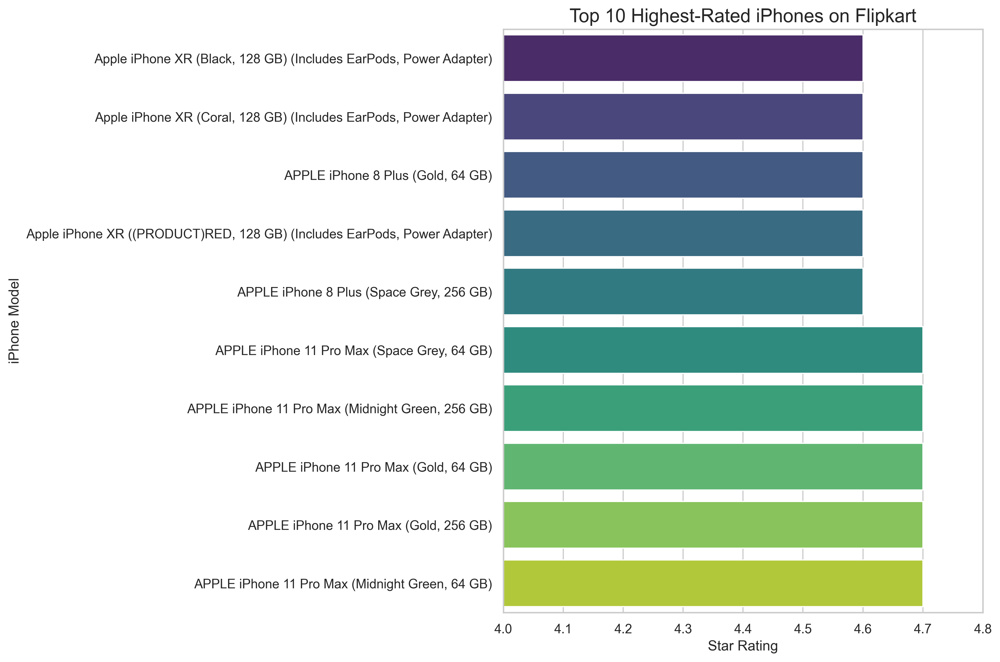
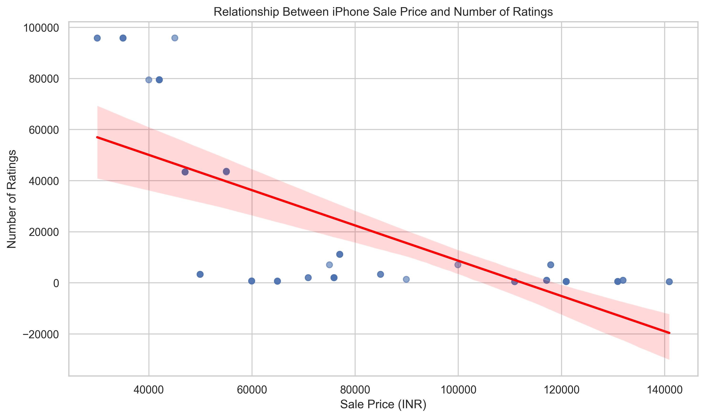
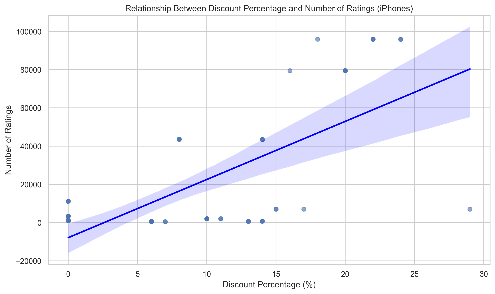

# 📱 Apple iPhone Sales Analysis on Flipkart (India)

This project analyzes Apple iPhone listings on Flipkart (India) to uncover insights about pricing, ratings, reviews, and discounts using Python.

---

## 🔍 Objective

To answer key business questions such as:
- Which iPhones are the highest rated?
- Do expensive iPhones get fewer ratings?
- Does discounting increase customer engagement?
- Which iPhone is the cheapest and the most expensive in India?

---

## 📊 Key Insights

- ⭐ **Top Rated Models:**  
  iPhone 11 Pro Max variants dominate the highest ratings (4.7⭐)

- 💸 **Price vs Ratings:**  
  Strong **negative correlation (-0.70)**  
  → Higher-priced iPhones receive fewer ratings

- 🔖 **Discount vs Ratings:**  
  Strong **positive correlation (+0.68)**  
  → Higher discounts attract more ratings

- 🏷️ **Price Extremes:**
  - Cheapest: iPhone SE (₹29,999)
  - Most Expensive: iPhone 12 Pro 512GB (₹1,40,900)

---

## 📈 Visualizations

### Top Rated iPhones


### Sale Price vs Ratings


### Discount vs Ratings


---

## 🛠 Tech Stack

- Python  
- Pandas  
- NumPy  
- Seaborn & Matplotlib  
- SciPy (Pearson Correlation)

---

## 📂 Dataset

Source: Flipkart product listings (Apple iPhones)  
File: `apple_products.csv`

---

## 🚀 How to Run

```bash
pip install -r requirements.txt
